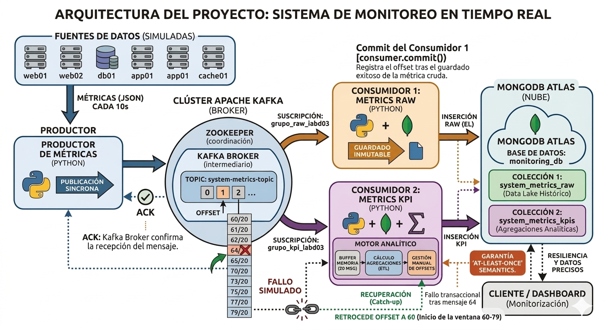

# RA4 BDA · Arquitectura de Monitoreo en "Streaming" con Apache Kafka y MongoDB

**Versión:** `v1.0-entrega`
**Contexto:** Proyecto de arquitectura de datos en tiempo real y tolerancia a fallos

Este repositorio contiene la implementación de una tubería de datos (*Data Pipeline*) asíncrona para la monitorización de telemetría de servidores (CPU, Memoria, Red, Errores). Todo el ecosistema está orquestado mediante el servidor intermediario **Apache Kafka** y los datos se persisten en la nube utilizando **MongoDB Atlas**.

---

## Objetivo del Proyecto
El proyecto implementa una **arquitectura de procesamiento de eventos (Event-Driven)** orientada a la simulación, ingesta y analítica en tiempo real:
1. **Generación (Productor):** Simulación de telemetría de un clúster de servidores y publicación continua de mensajes en un canal de Kafka con acuse de recibo síncrono.
2. **Ingesta Cruda (Consumidor RAW):** Suscripción al canal para extraer los datos al vuelo y volcarlos de manera inmutable en una colección de base de datos.
3. **Analítica en Tiempo Real (Consumidor KPI):** Implementación de una ventana de cálculo por bloques (*Tumbling Window*) que acumula mensajes, procesa promedios matemáticos y guarda los resultados agregados, garantizando la semántica de "Al menos una entrega" (*At-Least-Once*).

---

## Estructura del repositorio

```text
kafka-monitoring-lab/
├── consumer/                             # Módulo de ingesta y procesamiento de datos
│   ├── consumidor_metrics_kpi.py         # Script analítico: Calcula agregaciones en ventanas de 20 mensajes
│   └── consumidor_metrics_raw.py         # Script de ingesta rápida: Guarda historial inmutable
├── data/                                 # Muestras de datos exportadas desde MongoDB (Evidencias)
│   ├── muestras_kpis.json                # Muestra de documentos de la colección de KPIs agregados
│   └── muestras_raw.json                 # Muestra de documentos de la colección de métricas en bruto
├── docker/                               # Orquestación de contenedores
│   └── docker-compose.yml                # Configuración para levantar el clúster local de Apache Kafka
├── docs/                                 # Documentación original y evidencias del proyecto
│   └── evidencias.md                     # Archivo para la justificación, logs y capturas de pantalla
├── img/                                  # Directorio destinado a almacenar las capturas de evidencia e imágenes de arquitectura
├── producer/                             # Módulo de generación de datos
│   └── productor_metrics.py              # Script origen de datos: Simula métricas y las envía a Kafka
├── .env.example                          # Plantilla de variables de entorno para nuevos despliegues
├── .gitignore                            # Exclusión de archivos temporales y credenciales
└── README.md                             # Documentación principal del proyecto (Este archivo)
```
---

## Arquitectura del proyecto



---

## Pasos de Ejecución (Reproducibilidad)

A continuación se detallan los pasos exactos realizados para construir y desplegar este proyecto, cubriendo desde la configuración del entorno hasta la ejecución en paralelo.

### Paso 1: Configuración del entorno virtual e instalación de dependencias
Se recomienda aislar las dependencias del proyecto creando un entorno virtual en la raíz del repositorio:

```bash
python -m venv .venv
source .venv/bin/activate  # En Windows usar: .venv\Scripts\activate
pip install -r requirements.txt
```

### Paso 2: Configuración de Variables de Entorno (Seguridad)
Para cumplir con las buenas prácticas de seguridad y no exponer credenciales en el código fuente, la conexión a la base de datos se realiza a través de variables de entorno.

1. Crea un archivo `.env` en la raíz del proyecto.

2. Añade tu cadena de conexión a MongoDB Atlas como en este ejemplo:
```bash
MONGO_URI="mongodb+srv://<usuario>:<password>@cluster0.xxxxx.mongodb.net/?retryWrites=true&w=majority"
```

### Paso 3: Despliegue del Intermediario (Broker Kafka)
Asegúrate de tener un clúster de Apache Kafka operativo. En este entorno de desarrollo, el sistema apunta por defecto al servidor local `127.0.0.1:29092`. Si utilizas Docker, levanta los servicios mediante tu archivo compose:
```bash
docker-compose up -d
```

### Paso 4: Ejecución en Paralelo (Arquitectura Desacoplada)
El verdadero potencial de esta arquitectura reside en su capacidad asíncrona. Abre tres terminales distintas, activa el entorno virtual en todas ellas y ejecuta los scripts en el siguiente orden:

1. **Terminal 1 (El Origen)**:
```bash
python productor_metrics.py
```

2. **Terminal 2 (El Histórico)**: 
```bash
python consumidor_metrics_raw.py
```

3. **Terminal 3 (El Motor Analítico)**: 
```bash
python consumidor_metrics_kpi.py
```

---

## Características de la Arquitectura
El sistema incluye las siguientes características operativas avanzadas:

* **Patrón Publish/Subscribe:** Los consumidores RAW y KPI utilizan identificadores de grupo diferentes (`group_id`). Esto permite a Kafka replicar el flujo de datos exacto a ambos scripts en paralelo sin conflictos de lectura.
* **Ventana de Procesamiento (Tumbling Window):** El cálculo de KPIs no se hace mensaje a mensaje, sino acumulando "lotes" en memoria RAM (20 mensajes) antes de disparar la transformación matemática.
* **Tolerancia a fallos (At-Least-Once Delivery):** Se ha desactivado el autocompletado asíncrono (`enable_auto_commit=False`). El índice secuencial de lectura (Offset) de Kafka solo se confirma si, y solo si, la escritura del documento en MongoDB ha devuelto un estado exitoso.

---

## Decisiones de Arquitectura: ¿Por qué dos consumidores independientes?

Durante la fase de diseño inicial, se planteó la posibilidad de unificar la ingesta de datos RAW y el cálculo de KPIs en un único script. Sin embargo, se optó por una arquitectura **desacoplada de consumidores múltiples** por los siguientes motivos críticos de negocio y de ingeniería:

1. **Alta Disponibilidad de los KPIs (Requisito de Cliente):** El cliente determinó que la visualización de los KPIs es un elemento crítico para el negocio. Al separar los procesos, garantizamos el **aislamiento de fallos**. Si la base de datos RAW sufre un bloqueo o el esquema de un mensaje crudo genera una excepción, el consumidor RAW caerá, pero el consumidor KPI seguirá funcionando de forma aislada, garantizando que el cuadro de mando del cliente nunca se quede sin métricas agregadas.

2. **Separación de Responsabilidades (Separation of Concerns):** 
    * El consumidor `RAW` obedece a un patrón **EL (Extract-Load)** rápido y de baja latencia. Su objetivo es la persistencia inmediata.

    * El consumidor `KPI` obedece a un patrón **ETL en streaming (Extract-Transform-Load)**. Requiere memoria temporal (RAM) para mantener la *Tumbling Window* y capacidad de CPU para las agregaciones matemáticas. Mezclar ambos contextos ensucia el código fuente y dificulta su mantenimiento.

3. **Escalabilidad Independiente:** En un entorno de producción real, el cálculo de ventanas matemáticas consumirá mucha más memoria que la simple inserción de datos crudos. Tenerlos en scripts separados permite desplegarlos en servidores o contenedores (Docker/Kubernetes) con recursos de hardware diferentes, escalando el motor analítico sin malgastar recursos en el motor de ingesta.

---

## Resolución de Problemas

### 1. Error de Timeouts de MongoDB (ConnectionFailure)
* **Problema:** Al arrancar cualquiera de los scripts consumidores, el sistema lanza un error crítico de red al intentar hacer el `ping` de validación a la topología de la base de datos.
* **Solución:** Comprobar la IP Whitelist en MongoDB Atlas. Atlas bloquea por defecto cualquier petición externa. Es necesario acceder al panel de seguridad de Atlas (Network Access) y añadir la dirección IP pública actual de la máquina de desarrollo a la lista de accesos permitidos.

### 2. Recuperación de datos tras un "Crash" (Catch-Up)
* **Problema/Escenario:** Si el script analítico (`consumidor_metrics_kpi.py`) es interrumpido (ej. un `SIGINT`) cuando su ventana lleva 15 de 20 mensajes acumulados, esos mensajes se pierden de la memoria RAM.
* **Solución Técnica Aplicada:** Gracias a la gestión manual de offsets mencionada anteriormente, al reiniciar el script, el consumidor detectará que esos 15 mensajes no recibieron el commit transaccional. Kafka reenviará automáticamente los mensajes descartados desde el último registro seguro, procesando todo el retraso acumulado a máxima velocidad de procesador hasta ponerse al día con el flujo en tiempo real. Esto garantiza cero pérdida de datos.