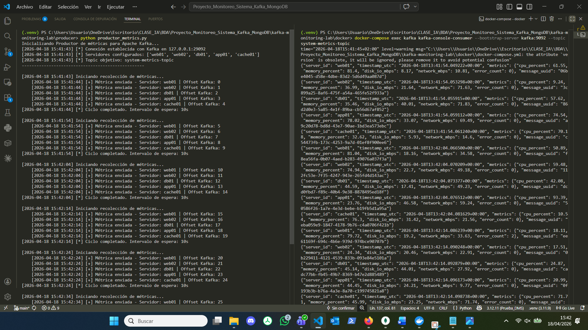
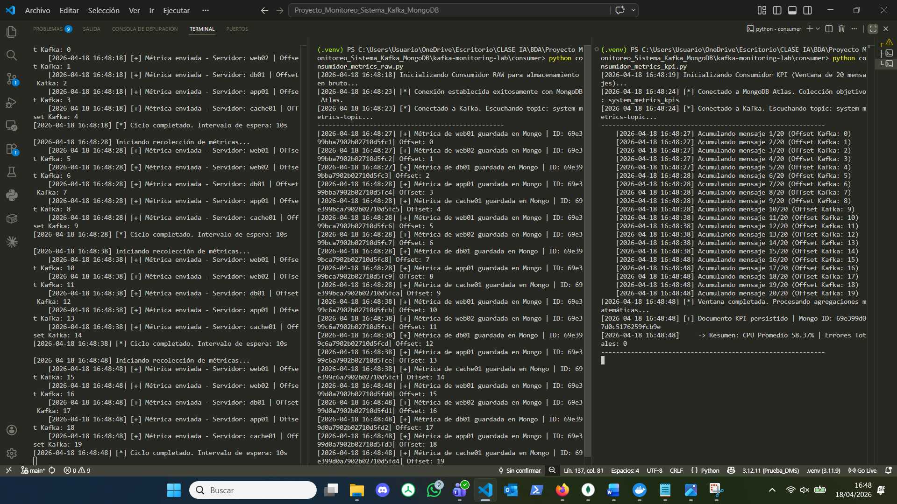
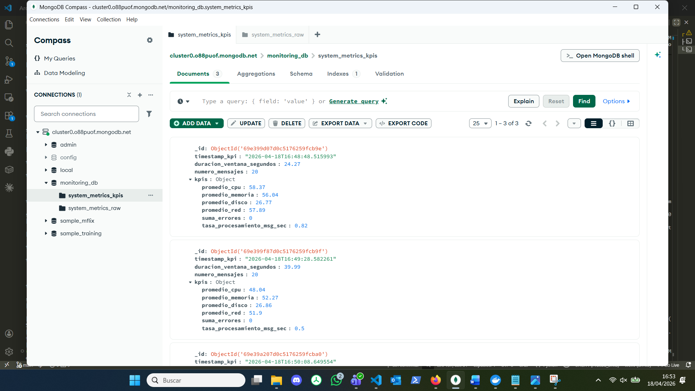
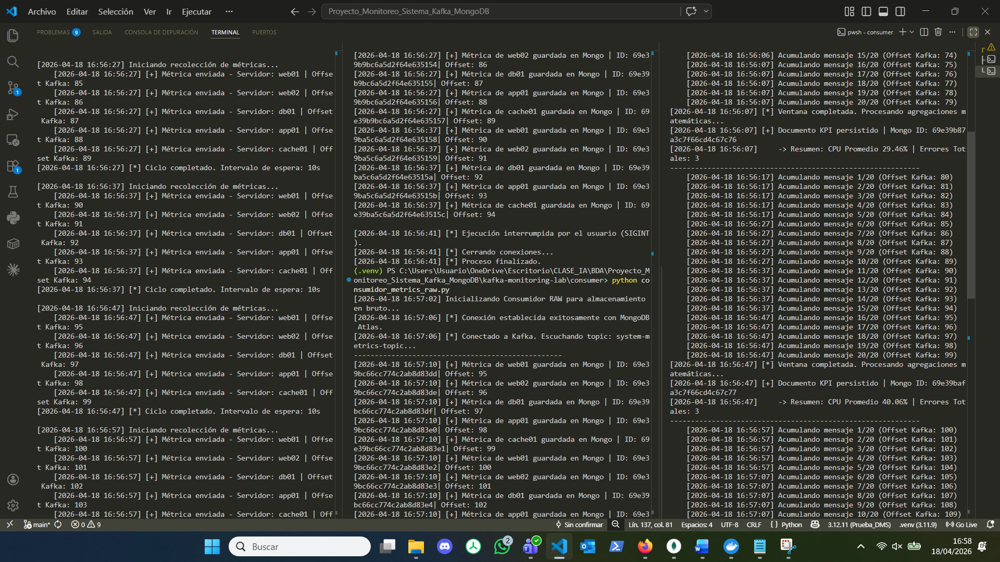
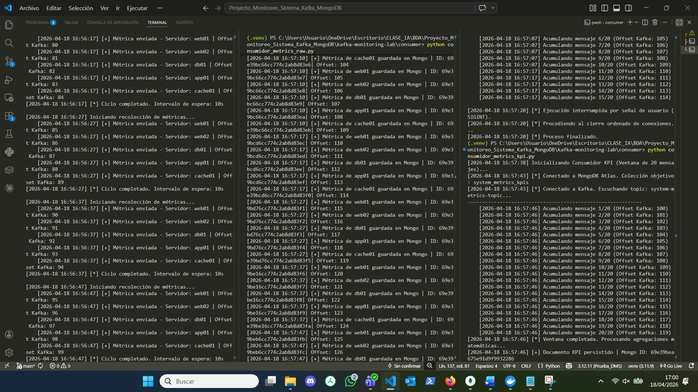

# Documentación de Evidencias y Pruebas de Integración (End-to-End)

Este documento recoge las pruebas visuales y los registros (logs) que demuestran el correcto funcionamiento de la arquitectura de *streaming* de datos construida con Apache Kafka y MongoDB. Se detallan las pruebas de inyección, procesamiento paralelo y persistencia.

---

## 1. Origen de Datos: Productor en Ejecución

Esta captura demuestra el funcionamiento del simulador de telemetría actuando como origen de datos (*Data Source*). 

**Explicación técnica:**
El script genera cargas útiles (*payloads*) en formato JSON simulando 5 servidores distintos. Como se aprecia en la captura, el Productor implementa una semántica de envío síncrono: espera la confirmación (ACK) del servidor intermediario (*Broker*) de Kafka para cada mensaje, garantizando que el clúster le ha asignado un **índice secuencial (Offset)** exacto antes de continuar. Esto previene la pérdida de datos en origen.



---

## 2. Procesamiento Paralelo: Consumidores Funcionando

Aquí se evidencia el patrón de **Publicación/Suscripción (Pub/Sub)** en pleno rendimiento. 

**Explicación técnica:**
Se han desplegado dos procesos analíticos independientes:
1. **Consumidor RAW:** Captura los mensajes al vuelo para su guardado histórico.
2. **Consumidor KPI:** Acumula mensajes en memoria y no ejecuta ninguna acción hasta que su "ventana por bloques" (*Tumbling Window*) alcanza exactamente los 20 mensajes.

Al pertenecer a **Grupos de Consumidores (Consumer Groups) distintos**, Kafka entrega una copia idéntica del flujo de datos a ambos scripts de forma simultánea, sin que compitan entre ellos por la lectura de los mensajes.



---

## 3. Persistencia Inmutable: Datos RAW en MongoDB

La siguiente evidencia confirma la correcta integración del Consumidor RAW con la base de datos en la nube (MongoDB Atlas).

**Explicación técnica:**
Se observa la colección `system_metrics_raw` poblada con documentos individuales. Este almacenamiento cumple una función de **auditoría o Data Lake**. Los documentos conservan la estructura inmutable (ID del servidor, porcentaje de CPU, I/O de disco, etc.) exactamente tal y como fueron emitidos por el Productor, validando la tubería de inyección sin transformaciones.


---

## 4. Agregación Analítica: Datos KPI en MongoDB

Esta captura es la prueba del correcto funcionamiento del motor de cálculo en tiempo real (Consumidor KPI).

**Explicación técnica:**
A diferencia del flujo RAW, la colección `system_metrics_kpis` contiene una cantidad reducida de documentos. Cada documento representa el **resumen matemático de 20 eventos crudos**. Se puede observar cómo el sistema ha calculado correctamente los promedios numéricos y la suma de errores durante la duración exacta de la ventana, demostrando capacidad de procesamiento y transformación en memoria (*ETL en streaming*).



---

## 5. Pruebas de Resiliencia y Registros (Logs)

La prueba definitiva de robustez arquitectónica reside en el comportamiento del sistema ante caídas abruptas. A continuación, se documentan las **pruebas de interrupción forzada (SIGINT)** sobre ambos consumidores para validar la semántica de entrega "Al menos una vez" (*At-Least-Once*).

### 5.1. Recuperación del Consumidor RAW (Ingesta Cruda)

**Explicación técnica:**
1. Se interrumpe el script RAW de manera abrupta. Mientras está inactivo, el Productor sigue enviando datos al intermediario (Kafka).
2. Al reiniciar el proceso, el consumidor consulta su último índice confirmado (*commit*).
3. En lugar de reanudar la lectura en el momento actual (lo que causaría pérdida de datos), el consumidor realiza un **"Catch-up" (Puesta al día)**: ingiere de golpe todos los mensajes acumulados durante el apagón a la máxima velocidad del procesador, estabilizándose después al ritmo normal del Productor.



---

### 5.2. Recuperación del Consumidor KPI (Ventana en Memoria)

**Explicación técnica:**
1. El sistema se interrumpe a mitad de una ventana matemática. Los mensajes acumulados temporalmente en la memoria RAM se destruyen antes de poder calcular el promedio.
2. Al reiniciar el proceso, la **gestión manual de confirmaciones** demuestra su eficacia: Kafka reconoce que esos mensajes extraídos no llegaron a transformarse en un documento KPI en la base de datos.
3. El sistema retrocede su lectura hasta el inicio de la ventana truncada, ingiriendo el retraso a máxima velocidad y completando la agregación de 20 mensajes de forma íntegra, sin duplicar información ni generar cálculos a medias.



**Log destacado de la interrupción y recuperación (KPI):**
```text
[2026-04-18 13:08:00] Acumulando mensaje 5/20 (Offset Kafka: 64)   
[2026-04-18 13:08:02] [*] Ejecución interrumpida por señal de usuario (SIGINT).

(Reinicio del sistema...)
[2026-04-18 13:08:28] [*] Conectado a Kafka. Escuchando topic: system-metrics-topic...
[2026-04-18 13:08:31] Acumulando mensaje 1/20 (Offset Kafka: 60)
... (Recuperación acelerada del buffer perdido) ...
[2026-04-18 13:08:31] Acumulando mensaje 20/20 (Offset Kafka: 79)  
[2026-04-18 13:08:31] [*] Ventana completada. Procesando agregaciones matemáticas...
[2026-04-18 13:08:31] [+] Documento KPI persistido | Mongo ID: 69e3662f5de6f15ad6b763e5